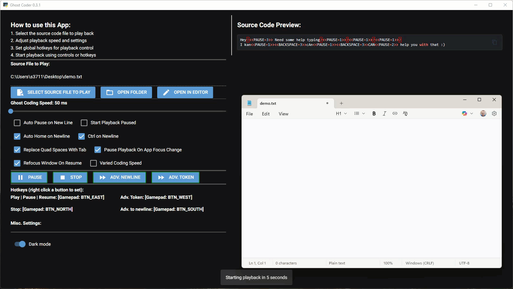

# Ghost Coder

**Automated code playback tool for creating coding tutorials and demo videos with hotkey-driven controls.**



## So what is it?!

Ghost Coder is a Windows application that allows you to load a source code file and automatically "type" it into any text editor or IDE, simulating realistic coding. Perfect for creating coding tutorials, recording demos, or practicing presentations without the stress of live coding.

## Features

- **Automated Typing Playback**: Load any text/code file and have it automatically typed character-by-character
- **Hotkey Control**: Configure global keyboard, mouse, or gamepad hotkeys to control playback from any application
- **Customizable Speed**: Adjust typing speed from 50ms to 500ms per character
- **Advanced Playback Options**:
  - Variable typing speed for more realistic coding simulation
  - Auto-pause on new lines
  - Start playback in paused mode
  - Auto-home cursor on newline
  - Quad-space to Tab replacement
  - Window focus detection with auto-pause
- **Special Syntax Support**: Includes special commands for pauses, scrolling, and repeated keys
- **Modern GUI**: Built with NiceGUI for an intuitive interface with dark mode support
- **MQTT-Based Architecture**: Multi-process design for responsive control and monitoring

## Installation

### From PyPI (Coming Soon)

```bash
pip install ghost-coder
```

### From Source

1. Clone the repository:
```bash
git clone https://github.com/sethstenzel/ghost-coder.git
cd ghost-coder
```

2. Install dependencies:
```bash
pip install -e .
```

## Usage

### Basic Usage

1. Run Ghost Coder:
```bash
ghost-coder
```

2. Select a source code file to playback
3. Adjust playback speed and settings as needed
4. Click on the text editor/IDE window where you want the code to appear
5. Click "PLAY" or use your configured hotkey to start playback

### Hotkey Configuration

Right-click any control button to assign a global hotkey:
- **Play/Pause/Resume**: Start or pause playback
- **Stop**: Stop playback and reset to beginning
- **Advance to Newline**: Skip to the next line
- **Advance Token**: Skip to the next character/token

Supports keyboard keys, mouse buttons, and gamepad controls.

### Command-Line Options

```bash
ghost-coder [--port PORT] [--logging] [--extbroker HOST:PORT]
```

- `--port`: Specify MQTT broker port (default: random available port)
- `--logging`: Enable detailed logging to `ghost_coder.log` and console
- `--extbroker` or `--extmqtt`: Connect to external MQTT broker (format: `host:port`)

## Configuration Options

### Playback Settings

- **Ghost Coding Speed**: Control typing speed (50-500ms per character)
- **Auto Pause on New Line**: Automatically pause when reaching a new line
- **Start Playback Paused**: Begin in paused mode, ready to advance manually
- **Auto Home on Newline**: Press Home key at the start of each new line
- **Ctrl on Newline**: Hold Ctrl when pressing Enter (useful for some IDEs)
- **Replace Quad Spaces With Tab**: Convert 4 spaces to Tab key
- **Pause Playback On App Focus Change**: Auto-pause when you switch windows
- **Refocus Window On Resume**: Automatically return focus to target window when resuming
- **Varied Coding Speed**: Add random variation (-50ms to +150ms) for realistic typing

## Special Syntax

Ghost Coder supports special syntax in your source files:

- `<<PAUSE>>`: Force a pause at this point in playback
- `<<SCROLL:UP:5>>`: Scroll up 5 times
- `<<SCROLL:DOWN:3>>`: Scroll down 3 times
- `<<DOWN:10>>`: Press down arrow 10 times
- `<<ENTER:5>>`: Press Enter 5 times

## Architecture

Ghost Coder uses a multi-process architecture with MQTT messaging:

- **Main UI Process**: NiceGUI-based interface running in native window mode
- **Broker Process**: Internal MQTT broker for inter-process communication
- **Listener Process**: Global input listener for hotkey detection
- **Typer Process**: Automated text input simulator with window focus tracking

This design ensures responsive UI and reliable hotkey detection while typing is in progress.

## Requirements

- Python 3.13+
- Windows OS (uses `pygetwindow` for window management)
- Dependencies (automatically installed):
  - nicegui >= 3.3.1
  - pynput >= 1.8.1
  - paho-mqtt >= 2.1.0
  - inputs >= 0.5
  - pygetwindow >= 0.0.9
  - loguru >= 0.7.3
  - pywebview >= 6.1

## Development

### Setting Up Development Environment

```bash
# Clone the repository
git clone https://github.com/sethstenzel/ghost-coder.git
cd ghost-coder

# Create virtual environment
python -m venv .venv
.venv\Scripts\activate  # Windows

# Install in editable mode with dev dependencies
pip install -e ".[dev]"
```

### Project Structure

```
ghost-coder/
├── src/
│   └── ghost_coder/
│       ├── app.py          # Main UI application
│       ├── typer.py        # Automated typing engine
│       ├── listener.py     # Global input listener
│       ├── broker.py       # MQTT broker process
│       ├── data.py         # Text parsing and token definitions
│       ├── utils.py        # Utility functions
│       └── hotkeys.json    # Saved hotkey configurations
├── pyproject.toml          # Project configuration
└── README.md
```

## License

MIT License - see [LICENSE](LICENSE) file for details

## Author

**Seth Stenzel** - [seth.c.stenzel@gmail.com](mailto:seth.c.stenzel@gmail.com)

## Links

- **Homepage**: [https://github.com/sethstenzel/ghost-coder](https://github.com/sethstenzel/ghost-coder)
- **Issues**: [https://github.com/sethstenzel/ghost-coder/issues](https://github.com/sethstenzel/ghost-coder/issues)
- **Repository**: [https://github.com/sethstenzel/ghost-coder](https://github.com/sethstenzel/ghost-coder)

## Contributing

Contributions are welcome! Please feel free to submit a Pull Request.

## Acknowledgments

Built with:
- [NiceGUI](https://nicegui.io/) - Python UI framework
- [pynput](https://pynput.readthedocs.io/) - Input control and monitoring
- [Eclipse Paho](https://www.eclipse.org/paho/) - MQTT client
- [inputs](https://inputs.readthedocs.io/) - Gamepad support
